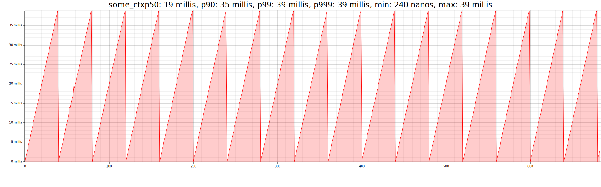

## profl
Simple timings profiler

### Example

```rust
fn main() -> std::io::Result<()> {
    profl::init("timings.data");

    let mut total = 0;
    for i in 0..1000 {
        total += profl::span!("some_ctx", {
            // long operation
            std::thread::sleep(std::time::Duration::from_millis(i % 40));
            i
        });
    }

    Ok(())
}
```

### Processing results:
```bash
profl --path timings.data
```

#### Rendered metrics (`plot.svg`)



#### Output:
```
All ids:
some_ctx: 684
Histogram for some_ctx
Distribution
    0µs | *                                        |  0.1th %-ile
 1114µs | **                                       |  5.1th %-ile
 3145µs | ***                                      | 10.5th %-ile
 5242µs | **                                       | 15.4th %-ile
 7340µs | ***                                      | 20.5th %-ile
 9437µs | **                                       | 25.4th %-ile
11534µs | **                                       | 30.4th %-ile
13631µs | **                                       | 35.2th %-ile
15728µs | ***                                      | 40.4th %-ile
17825µs | **                                       | 45.3th %-ile
19922µs | **                                       | 50.1th %-ile
20971µs | **                                       | 52.8th %-ile
22020µs | *                                        | 55.3th %-ile
23068µs | **                                       | 58.3th %-ile
24117µs | **                                       | 62.1th %-ile
25165µs | **                                       | 64.9th %-ile
26214µs | *                                        | 67.1th %-ile
27262µs | **                                       | 69.7th %-ile
28311µs | **                                       | 72.7th %-ile
28311µs |                                          | 72.7th %-ile
29360µs | *                                        | 75.1th %-ile
30408µs | *                                        | 77.6th %-ile
30408µs |                                          | 77.6th %-ile
31457µs | *                                        | 80.0th %-ile
32505µs | **                                       | 82.6th %-ile
32505µs |                                          | 82.6th %-ile
32505µs |                                          | 82.6th %-ile
33554µs | *                                        | 85.1th %-ile
33554µs |                                          | 85.1th %-ile
35651µs | **                                       | 90.1th %-ile
35651µs |                                          | 90.1th %-ile
35651µs |                                          | 90.1th %-ile
35651µs |                                          | 90.1th %-ile
35651µs |                                          | 90.1th %-ile
```
